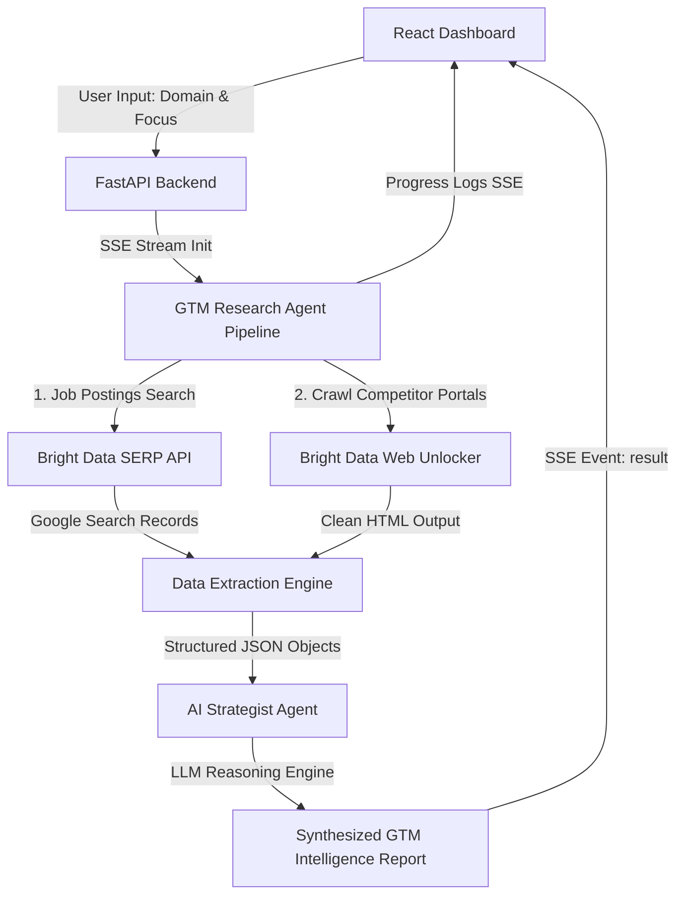

# 🔓 VEIN.intel — Autonomous GTM & Competitor Intelligence Suite

**Built for the Web Data UNLOCKED Hackathon (May 2026)**

Every modern Go-To-Market (GTM) team faces the same challenge: public web data is stale, rate-limited, or blocked by advanced anti-bot protections. **VEIN.intel** unlocks the web for revenue operations, marketing, and sales by deploying autonomous AI research agents backed by **Bright Data's** production-ready data collection infrastructure.

Through an elegant, glassmorphic dark-mode dashboard, VEIN.intel automatically tracks hiring indicators, competitor positioning, and pricing matrices in real time, synthesizing personalized outreach strategies and custom battlecards.

---

## 🚀 Key Features

*   **Real-Time Agent Execution Console**: A premium terminal UI displaying step-by-step logs of the autonomous agent's live requests (SERP scans, Web Unlocker bypassing, data parsing).
*   **Hiring & Roadmap Insights**: Aggregates job vacancies via **SERP API** and reasons over *why* a company is hiring (e.g., predicting that hiring a Mobile Lead indicates a new app launch).
*   **Competitor Positioning Battlecards**: Maps the competitive landscape, highlighting direct advantages and key vulnerabilities.
*   **Personalized GTM Outreach Suite**: Synthesizes custom Ideal Customer Profiles (ICP), maps core buyer pain points, and generates ready-to-run cold outreach scripts with a one-click clipboard copy utility.
*   **Graceful Sandbox Fallback Mode**: If Bright Data or AI provider credentials are not yet configured, the app seamlessly runs on a rich pre-cached sandbox simulation of top tech brands (Linear, Stripe, Vercel, and VEIN.intel itself), ensuring immediate evaluate-ready capability for hackathon judges.

---

## 🛠️ Architecture & Bright Data Integration



1.  **Bright Data SERP API**: Queries Google indexes for active job roles, brand updates, and discussions without ever hitting rate limits.
2.  **Bright Data Web Unlocker**: Routes HTTP crawler requests through residential proxy nodes, automatically resolving CAPTCHAs and bypassing Cloudflare protections to capture raw text from competitor sites.

---

## 💻 Tech Stack

*   **Frontend**: Vite, React, Vanilla CSS (Premium Obsidian Dark Theme, Custom Transitions, CSS Variables).
*   **Icons**: Lucide React.
*   **Backend**: FastAPI, Python 3, Uvicorn, Python-dotenv.

---

## 🏃 Quick Start (Local Setup)

### Prerequisites
Make sure you have **Python 3.8+** and **Node.js 16+** installed on your system.

### 1. Configure Environment Variables
Copy `.env.template` into a new `.env` file inside the `backend` directory:
```bash
cp backend/.env.template backend/.env
```
Fill in your credentials to unlock live web operations. If left empty, the application will run in **Sandbox Demo Mode**.

---

### 2. Start the Backend Server
Navigate to the `backend` directory, install requirements, and run the FastAPI server:

```powershell
cd backend
pip install -r requirements.txt
python main.py
```
The server will boot at `http://127.0.0.1:8000/`. You can view the automated OpenAPI documentation at `http://127.0.0.1:8000/docs`.

---

### 3. Start the Frontend Dev Environment
Navigate to the `frontend` directory, install package dependencies, and start the Vite dev server:

```powershell
cd frontend
npm install
npm run dev
```
Open your browser and navigate to `http://127.0.0.1:5173/` to see the gorgeous live dashboard in action!
